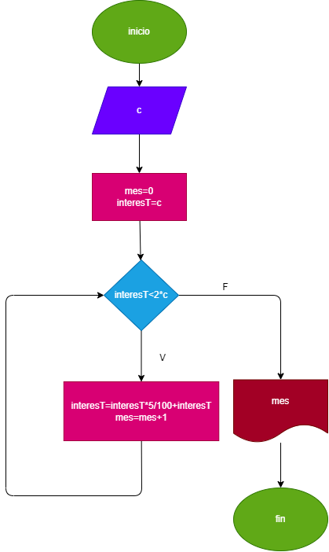

# Ejercicio-26-instrucciones-repetitivas

#
# hacer el diagram de flujo y el programa en phyton que lea un capital "c" y que averigue y immprima en cuantos meses se duplica si lo colocamos a un interes compuesto del 5% mensual 

# Diagrama de flujo:
